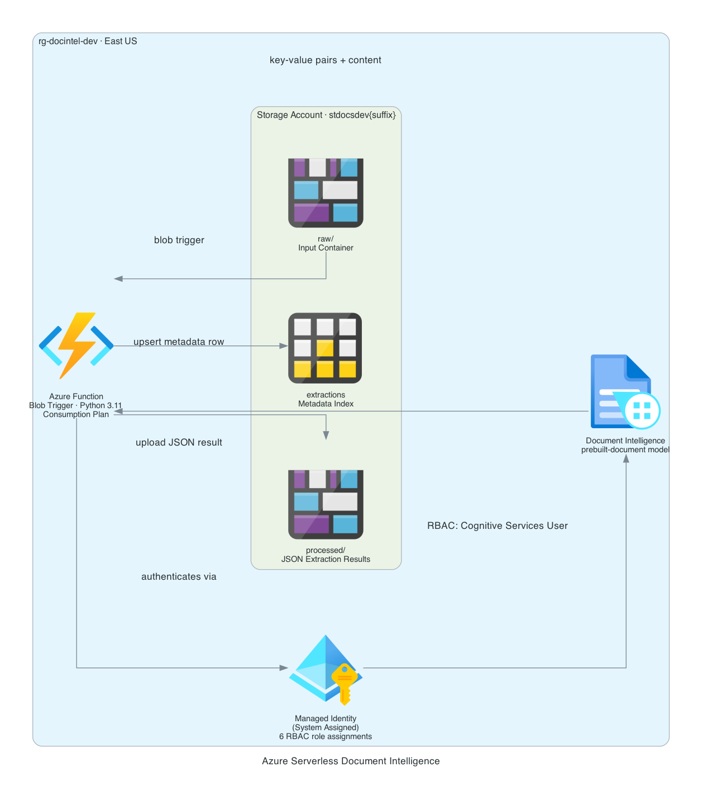

# Azure Serverless Document Intelligence

[](https://github.com/jordann6/azure-document-intelligence/actions/workflows/validate.yml)

Terraform-managed Azure infrastructure that automatically extracts structured data from documents uploaded to Blob Storage. Dropping any file into the `raw` container triggers an Azure Function, which submits the document to Azure AI Document Intelligence (prebuilt-document model), writes the extracted key-value pairs and content to a `processed` container as JSON, and records metadata in Table Storage for fast querying. All service-to-service authentication uses Managed Identity — no keys or connection strings stored in application config.

## Architecture



| Component | Resource | Purpose |
|---|---|---|
| Storage Account (docs) | `stdocs{env}{suffix}` | `raw` input container, `processed` output container, `extractions` Table Storage index |
| Storage Account (runtime) | `stfunc{env}{suffix}` | Function App runtime — AzureWebJobsStorage via managed identity |
| Document Intelligence | `cog-docintel-{env}-{suffix}` | Prebuilt document model — key-value extraction, content parsing |
| Function App | `func-docintel-{env}-{suffix}` | Python 3.11 blob trigger — orchestrates extraction and output |
| App Service Plan | `plan-docintel-{env}` | Consumption (Y1) — pay per execution |
| Managed Identity | System-assigned | Keyless auth to both storage accounts and Document Intelligence |

## Flow

```
Upload to raw/         →  Blob trigger fires
  Function reads blob  →  Calls Document Intelligence (prebuilt-document)
  Writes JSON result   →  processed/{filename}.json
  Writes metadata row  →  Table Storage: extractions (PartitionKey=document)
```

## Features

- **Zero credentials in config** — AzureWebJobsStorage and document storage both use identity-based connections (`__blobServiceUri` pattern)
- **Managed Identity role assignments** — six scoped RBAC assignments; no over-privileged contributor roles
- **Prebuilt-document model** — extracts key-value pairs, tables, and raw content without custom training
- **Table Storage index** — each processed document writes a metadata row for instant query without scanning blobs
- **Two storage accounts** — runtime storage isolated from document storage; blast radius contained per account
- **OIDC CI/CD** — GitHub Actions authenticates to Azure via federated credentials, no stored secrets

## Prerequisites

- Azure subscription with permissions to create resource groups, storage accounts, cognitive services, and function apps
- Azure backend storage account for Terraform state (`rg-tfbackend-jordprojs` / `sttfbejordprojs8557` — see existing backend)
- Document Intelligence (FormRecognizer) resource provider registered in your subscription
- Terraform >= 1.6
- Azure CLI

## Deploy

```bash
az login

cd terraform
terraform init
terraform plan
terraform apply
```

## Deploy Function Code

After `terraform apply`, deploy the function code:

```bash
FUNC_APP=$(terraform output -raw function_app_name)

cd ../function
func azure functionapp publish "$FUNC_APP" --python
```

## Seed and Test

```bash
STORAGE=$(terraform output -raw documents_storage_account)

bash ../scripts/seed_documents.sh "$STORAGE"
```

The script uploads a sample invoice, waits 30 seconds for the trigger to fire, then lists the processed container and queries Table Storage for the metadata row.

To manually inspect an extraction result:

```bash
az storage blob download \
  --account-name "$STORAGE" \
  --container-name processed \
  --name "sample_invoice.json" \
  --file /tmp/result.json \
  --auth-mode login

cat /tmp/result.json | jq .key_value_pairs
```

## Variables

| Variable | Default | Description |
|---|---|---|
| `location` | `eastus` | Azure region |
| `environment` | `dev` | Environment tag suffix |

## CI/CD

GitHub Actions deploys via OIDC (federated credentials — no stored secrets). Register a federated identity credential on your app registration for the GitHub Actions subject, then configure:

| Secret | Description |
|---|---|
| `AZURE_CLIENT_ID` | App registration client ID |
| `AZURE_TENANT_ID` | Azure AD tenant ID |
| `AZURE_SUBSCRIPTION_ID` | Target subscription ID |

Push to `main` triggers plan + apply. Pull requests run plan only.

## Outputs

| Output | Description |
|---|---|
| `function_app_name` | Function App name (for `func publish`) |
| `documents_storage_account` | Storage account name for raw/processed containers |
| `doc_intel_endpoint` | Document Intelligence endpoint URL |
| `resource_group_name` | Resource group containing all resources |

## Tech Stack

- **Terraform** `>= 1.6` · `azurerm ~> 3.100` · `random ~> 3.0`
- **Azure Functions** (Python 3.11, v2 model) — blob trigger, consumption plan
- **Azure AI Document Intelligence** — `prebuilt-document` model, S0 SKU
- **Azure Blob Storage** — `raw` input container, `processed` output container
- **Azure Table Storage** — `extractions` table for processed document metadata
- **Azure Managed Identity** — system-assigned; six RBAC role assignments, zero stored credentials
- **GitHub Actions** — OIDC federated auth via `azure/login@v2`
